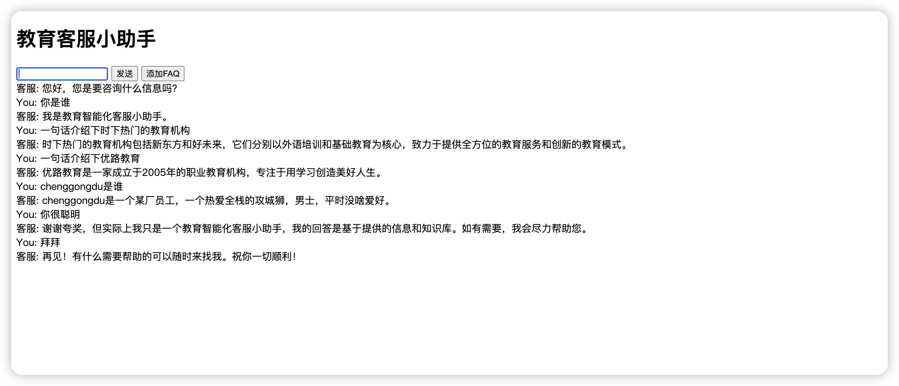

#### 项目名来源
>在希腊神话中，掌握信息的神是赫尔墨斯（Hermes）。赫尔墨斯是奥林匹斯众神中的一员，他是智慧和消息的传递者。赫尔墨斯被认为是乌尔阿努斯（Uranus）和莫伊拉（Maia）的儿子，同时也是宙斯的孙子。

#### 项目介绍
- 项目采用flask+socketio+pinecone+langchain+openai实现的一个定制化问答系统
- 支持流式问答

#### 部署步驟
pip install -r requirements.txt

#### 项目目录说明
- base: 基础模块-存放了项目的基础类
- base.load: 加载模块-临时存放了txt文件与pdf文件加载到向量数据库的操作
- config: 配置模块-存放了项目的配置文件
- data: 数据模块-存放了要加载的临时文件
- template: 临时存放了测试用的html文件

#### todo代办事项
1. 前端页面采用vue3+ts重构
2. 添加Agent针对不同领域进行解答
3. 支持文心一言千帆大模型api调用

#### 项目使用架构
- 「flask」: https://github.com/pallets/flask
- 「langchain」: https://github.com/hwchase17/langchain
- 「Flask-SocketIO」: https://github.com/miguelgrinberg/Flask-SocketIO

#### 项目使用向量数据库
- 「Pinecone」: https://www.pinecone.io/

#### 效果展示

#### 贡献
- 欢迎大家提出issue和pr
- [github]https://github.com/chenggongdu/hermes
- [gitee]https://gitee.com/Edon-Du/hermes